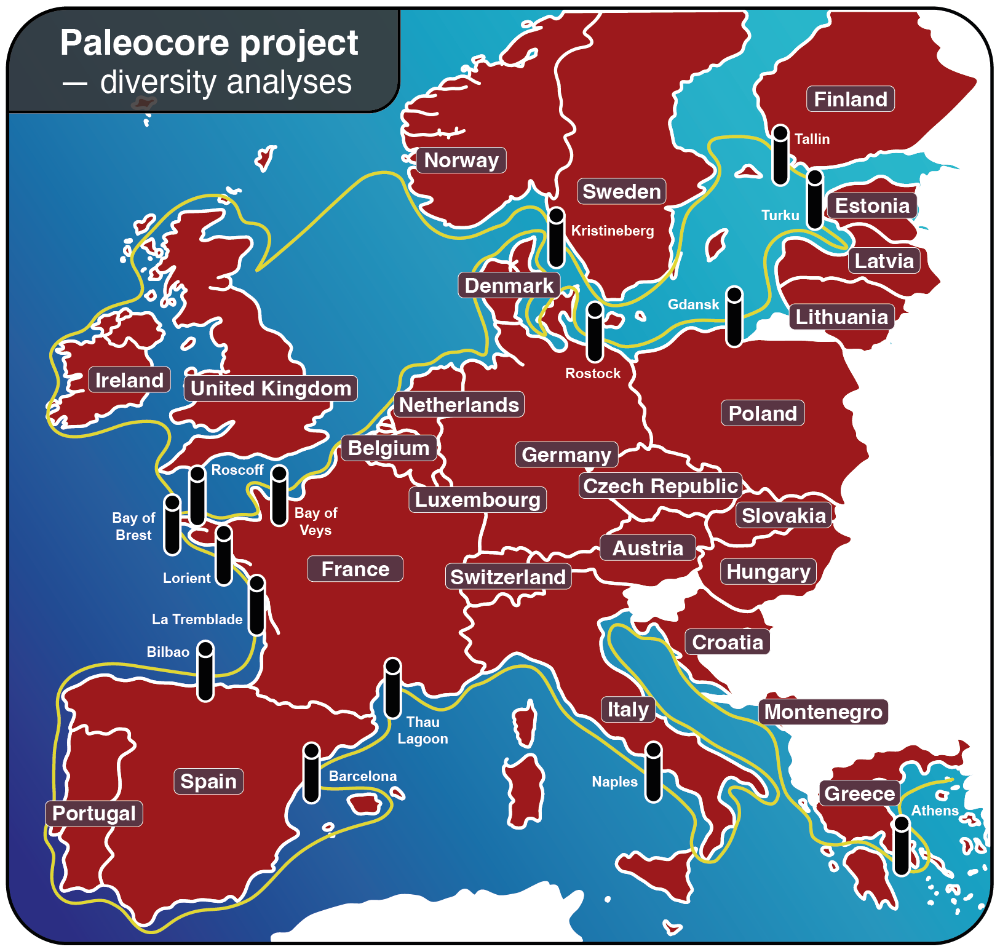

# **ADNe_lab_AM**

[](https://www.embl.org)
[](https://biocean5d.org)

[](http://www.repostatus.org/#active)

**This is a training workflow for diversity analysis of a reduced dataset derived from the Paleocore project (*i.e.* BIOcean 5D, Task 1.2)**



## **Repository structure:**

        Paleocore
        ├── 01_Dada2_18SV4.Rmd
        ├── ADNe_lab_AM.RData
        ├── README.md
        ├── Reads_Clean
        ├── assets
        │   └── Map_paleocore.png
        ├── database
        │   └── pr2_version_5.1.1_SSU_dada2.fasta.gz
        └── metadata.csv
        

## **Clone repository:**

To reproduce all the workflow, please follow instructions bellow:

```bash
git clone https://github.com/amonjot/ADNe_lab_AM.git
cd ADNe_lab_AM/
```


## CITATION


## REFERENCES

### Metabarcoding workflow analysis to obtain ASVs table from illumina short reads amplicons


1. Callahan BJ, McMurdie PJ, Rosen MJ, et al. DADA2: High-resolution sample inference from Illumina amplicon data. Nat Methods. 2016; 13(7):581-583. doi: 10.1038/nmeth.3869

2. Guillou L, Bachar D, Audic S, et al. The Protist Ribosomal Reference database (PR2): a catalog of unicellular eukaryote Small Sub-Unit rRNA sequences with curated taxonomy. Nucleic Acids Research. 2013; 41(D1):D597-D604. doi: 10.1093/nar/gks1160

### ASV and Sample Filtering scripts


2. Oksanen J, Simpson GL, Blanchet FG, et al. vegan: Community Ecology Package. 2001. v2.6-8. https://CRAN.R-project.org/package=vegan

3. Wickham H. Ggplot2: Elegant Graphics for Data Analysis. Second edition. Cham: Springer international publishing; 2016. https://ggplot2.tidyverse.org

4. Wickham H, Averick M, Bryan J, et al. Welcome to the Tidyverse. JOSS. 2019; 4(43):1686. doi: 10.21105/joss.01686


## CONTACT
<div itemscope itemtype="https://schema.org/Person"><a itemprop="sameAs" content="https://orcid.org/0000-0002-6978-4785" href="https://orcid.org/0000-0002-6978-4785" target="orcid.widget" rel="noopener noreferrer" style="vertical-align:top;"> Arthur Monjot</a></div>
Arthur.Monjot.pro[at]gmail.com
